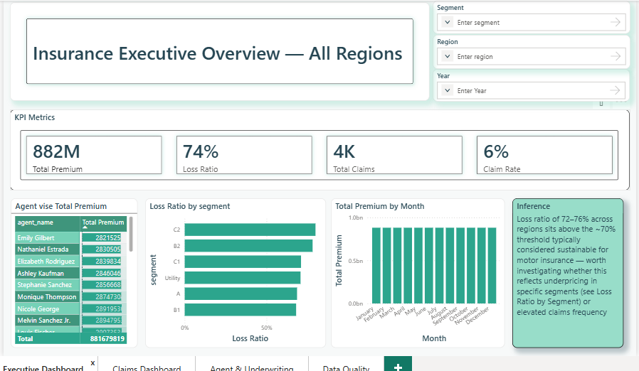
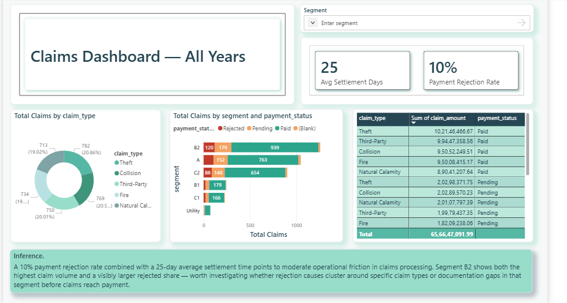
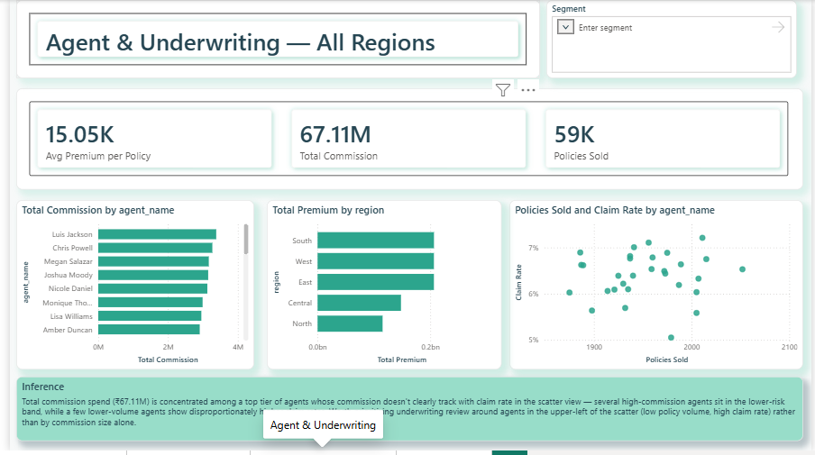
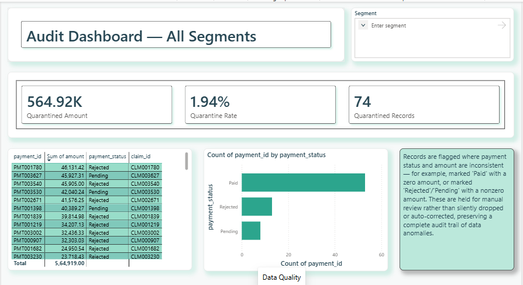

# Enterprise Insurance Lakehouse & Analytics Platform

An end-to-end insurance analytics platform: raw policy/claims data →
Databricks Lakehouse (medallion architecture) → dbt (transformation,
testing, lineage) → Power BI (executive, claims, agent, and data
quality reporting).



## Why this project exists

Insurance companies typically run several disconnected source systems
— policy administration, claims, payments, agent/broker management —
each owning its own data with no unified view. This project builds a
governed lakehouse platform that ingests, cleans, models, and reports
on this data as a single pipeline, answering questions like:

- What is our loss ratio, and is it trending favorably?
- Which vehicle/policy segments are unprofitable relative to premium?
- How long does it take to settle a claim, and where are the bottlenecks?
- Which agents' portfolios carry disproportionate claims risk?
- How do we know the underlying data itself can be trusted?

## Architecture

```
Source Files
     │
     ▼
PySpark (ingestion, Bronze)  — reads raw files, applies enrichment logic
     │
     ▼
Bronze  (raw Delta tables — immutable audit trail)
     │
     ▼
dbt — Silver  (cleaning, deduplication, data-quality quarantine logic)
     │
     ▼
dbt — Gold  (star schema: Fact/Dim tables)
     │
     ▼
Databricks SQL Warehouse
     │
     ▼
Power BI  (reporting layer only — no transformation happens here)
     │
     ▼
Power BI Service (published, refreshed live from the SQL Warehouse)
```

**Why two tools, not one:** PySpark handles ingestion because it can
read raw files and run custom enrichment logic (synthetic data
generation via Faker) that SQL cannot. dbt handles all Silver/Gold
transformation because it's purpose-built for SQL-native modeling,
automated testing, and lineage tracking — capabilities that would
otherwise have to be hand-rolled in notebook `print()` statements.

See [`docs/architecture.md`](docs/architecture.md) for the full
design rationale, including why a Lakehouse over a Data Warehouse or
Data Lake alone, and why a star schema over Snowflake/Data Vault
alternatives.

## Data quality — a real validation story, not just a rule

A quarantine rule flags payment records with inconsistent
status/amount combinations. When first tested, it flagged **zero**
records — not because the data was clean, but because the synthetic
generator only ever produced internally consistent data, so the rule
had nothing to catch.

Rather than treat that as a pass, a small number of deliberately
inconsistent records were injected to confirm the rule genuinely
detects anomalies. It then correctly caught 74 records (1.94% of
payments), and the Gold layer was updated to accurately label
affected claims (`'Payment Quarantined'`) instead of leaving an
unexplained blank in downstream reporting. Full writeup in
[`docs/data-quality.md`](docs/data-quality.md).

## Repository structure

```
├── notebooks/          PySpark notebooks (Bronze ingestion + enrichment)
├── dbt_project/        dbt project — Silver + Gold models, tests, docs
├── powerbi/            .pbix file
├── docs/               Architecture, data dictionary, design decisions
└── screenshots/        Dashboard screenshots (all 4 pages)
```

## Dashboards

| Page | What it answers |
|---|---|
| Executive Overview | Loss ratio, claim rate, premium/claims trend, agent performance |
| Claims | Claim type mix, settlement time, rejection rate, segment risk |
| Agent & Underwriting | Commission vs. claim rate, regional premium, volume-vs-risk |
| Audit / Data Quality | Quarantined records, amount at risk, full audit trail |





To explore the report interactively, open `powerbi/*.pbix` in Power BI
Desktop (free).

## Tech stack
Databricks (Delta Lake, Unity Catalog, SQL Warehouse), PySpark, dbt,
SQL, Power BI (DAX, Power Query, data modeling, Power BI Service).
